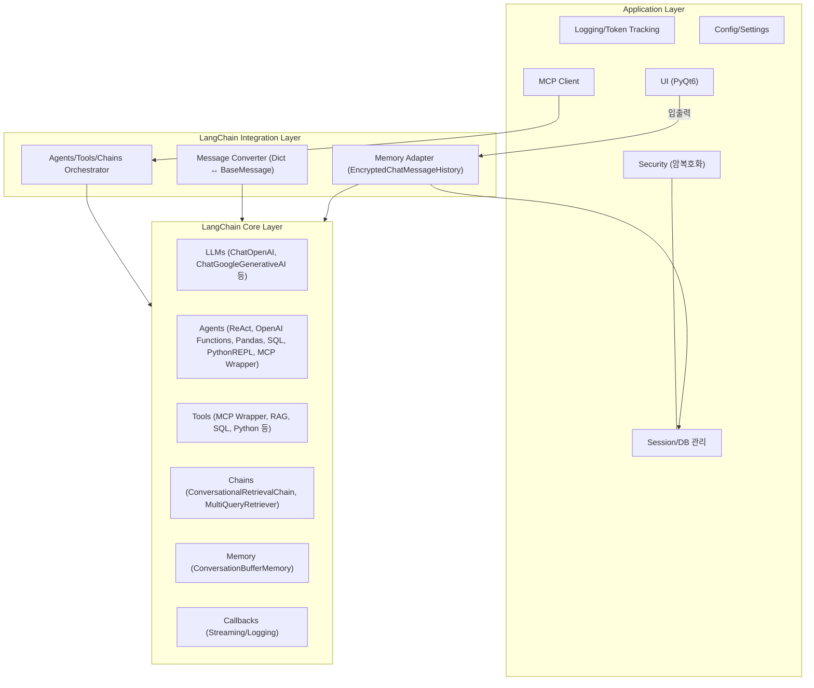
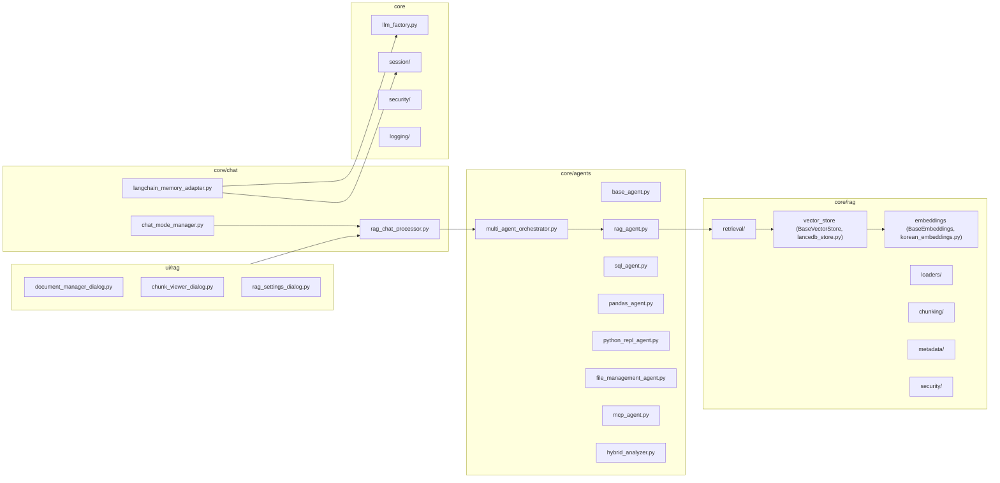
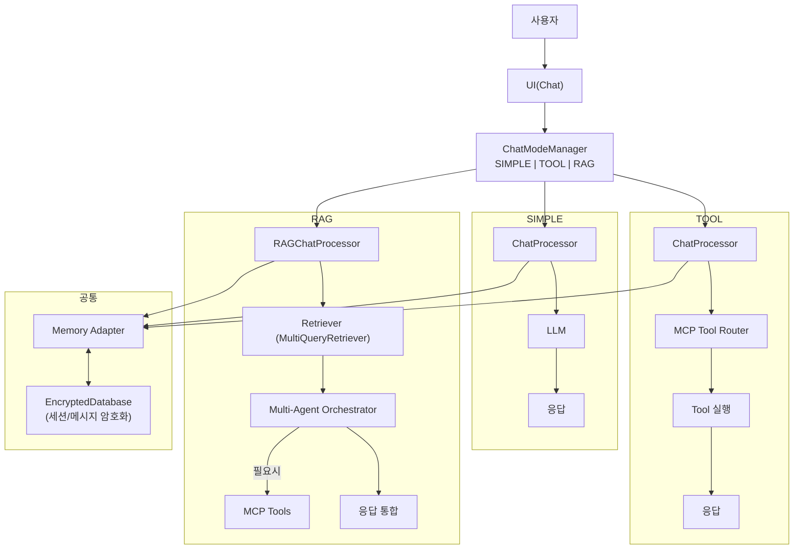
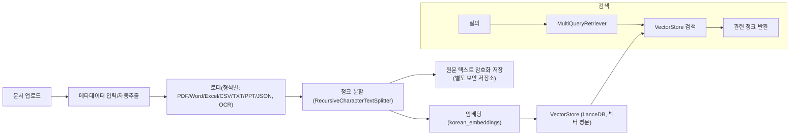
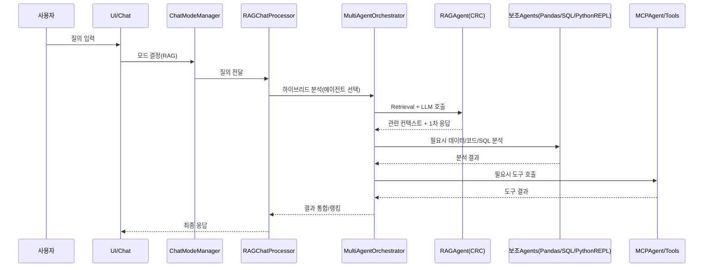
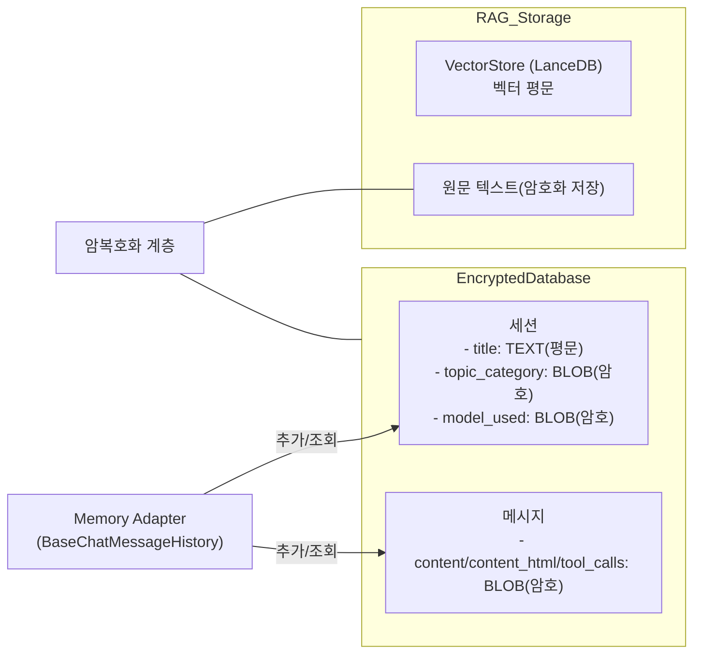
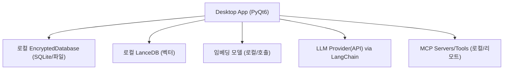

# 아키텍쳐 다이어그램 그리기
_Exported on 2025. 11. 4. at 18시 24분 6초 GMT+9 from Cursor (2.0.43)_

---

**User**

@RAG_MULTIAGENT_REFACTORING_PLAN.md  기준으로 아키텍쳐 그려죠

---

**Cursor**

지금 요청하신 아키텍처 다이어그램을 계획에 담아 제공하겠습니다. 먼저 고수준 레이어, 컴포넌트, 데이터플로우(채팅/RAG), 멀티에이전트 시퀀스, DB/배포 뷰를 포함한 간결한 다이어그램 세트를 정리해 제출할게요. 승인되면 바로 다이어그램을 전달하겠습니다.

---

**User**

Implement the plan as specified. To-do's from the plan have already been created. Do not create them again. Mark them as in_progress as you work, starting with the first one.

@RAG_MULTIAGENT_REFACTORING_PLAN.md 분석후 mermaid로 시스템 아키텍쳐 그려죠

---

**Cursor**

다음은 계획서 기반 시스템 아키텍처를 Mermaid로 요약한 다이어그램 세트입니다.

### 레이어드 아키텍처


### 컴포넌트(디렉토리 매핑)


### 채팅 모드별 데이터 플로우(SIMPLE/TOOL/RAG)


### RAG 문서 처리 파이프라인


### Multi-Agent 오케스트레이션 시퀀스


### DB/보안 컨텍스트


### 배포/런타임 뷰


원하시면 특정 다이어그램을 더 세분화하거나, 각 노드에 실제 파일 경로 주석을 추가한 버전으로 확장해 드리겠습니다.

```plaintext
flowchart TB
  subgraph Application_Layer["Application Layer"]
    UI["UI (PyQt6)"]
    CONFIG["Config/Settings"]
    SECURITY["Security (암복호화)"]
    SESSION["Session/DB 관리"]
    LOGGING["Logging/Token Tracking"]
    MCP_CLIENT["MCP Client"]
  end

  subgraph LangChain_Integration["LangChain Integration Layer"]
    MEM_ADAPTER["Memory Adapter (EncryptedChatMessageHistory)"]
    MSG_CONV["Message Converter (Dict ↔ BaseMessage)"]
    ORCH["Agents/Tools/Chains Orchestrator"]
  end

  subgraph LangChain_Core["LangChain Core Layer"]
    LLMs["LLMs (ChatOpenAI, ChatGoogleGenerativeAI 등)"]
    AGENTS["Agents (ReAct, OpenAI Functions, Pandas, SQL, PythonREPL, MCP Wrapper)"]
    TOOLS["Tools (MCP Wrapper, RAG, SQL, Python 등)"]
    CHAINS["Chains (ConversationalRetrievalChain, MultiQueryRetriever)"]
    MEMORY["Memory (ConversationBufferMemory)"]
    CALLBACKS["Callbacks (Streaming/Logging)"]
  end

  UI -->|입출력| MEM_ADAPTER
  MEM_ADAPTER --> SESSION
  MEM_ADAPTER --> LangChain_Core
  MSG_CONV --> LangChain_Core
  ORCH --> LangChain_Core

  CONFIG --- Application_Layer
  SECURITY --- SESSION
  LOGGING --- Application_Layer
  MCP_CLIENT --> ORCH
```

```plaintext
flowchart LR
  subgraph core/chat
    LMA["langchain_memory_adapter.py"]
    RCP["rag_chat_processor.py"]
    CMM["chat_mode_manager.py"]
  end

  subgraph core/agents
    BA["base_agent.py"]
    RA["rag_agent.py"]
    SA["sql_agent.py"]
    PA["pandas_agent.py"]
    PY["python_repl_agent.py"]
    FA["file_management_agent.py"]
    MA["mcp_agent.py"]
    OR["multi_agent_orchestrator.py"]
    HA["hybrid_analyzer.py"]
  end

  subgraph core/rag
    VS["vector_store (BaseVectorStore, lancedb_store.py)"]
    EMB["embeddings (BaseEmbeddings, korean_embeddings.py)"]
    LD["loaders/"]
    CK["chunking/"]
    MD["metadata/"]
    SEC["security/"]
    RT["retrieval/"]
  end

  subgraph core
    LLF["llm_factory.py"]
    SES["session/"]
    SEC2["security/"]
    LOG["logging/"]
  end

  subgraph ui/rag
    DMD["document_manager_dialog.py"]
    CVD["chunk_viewer_dialog.py"]
    RSD["rag_settings_dialog.py"]
  end

  CMM --> RCP
  RCP --> OR
  OR --> RA
  RA --> RT
  RT --> VS
  VS --> EMB
  LMA --> SES
  LMA --> LLF
  ui/rag --> RCP
```

```plaintext
flowchart TB
  USER["사용자"] --> UI["UI(Chat)"]
  UI --> MODE["ChatModeManager\nSIMPLE | TOOL | RAG"]

  subgraph SIMPLE
    CP1["ChatProcessor"] --> LLM1["LLM"]
    LLM1 --> RESP1["응답"]
  end

  subgraph TOOL
    CP2["ChatProcessor"] --> MCPR["MCP Tool Router"]
    MCPR --> TOOL_RUN["Tool 실행"]
    TOOL_RUN --> RESP2["응답"]
  end

  subgraph RAG
    RCP3["RAGChatProcessor"] --> RET["Retriever (MultiQueryRetriever)"]
    RET --> OR3["Multi-Agent Orchestrator"]
    OR3 -->|필요시| MCP3["MCP Tools"]
    OR3 --> RESP3["응답 통합"]
  end

  MODE --> CP1
  MODE --> CP2
  MODE --> RCP3

  subgraph 공통
    MEM["Memory Adapter"] <--> DB["EncryptedDatabase\n(세션/메시지 암호화)"]
  end

  CP1 --> MEM
  CP2 --> MEM
  RCP3 --> MEM
```

```plaintext
flowchart LR
  UP["문서 업로드"] --> MET["메타데이터 입력/자동추출"]
  MET --> LD["로더(형식별: PDF/Word/Excel/CSV/TXT/PPT/JSON, OCR)"]
  LD --> CHK["청크 분할 (RecursiveCharacterTextSplitter)"]
  CHK --> EMB["임베딩 (korean_embeddings)"]
  EMB --> VS["VectorStore (LanceDB, 벡터 평문)"]
  CHK --> ENC["원문 텍스트 암호화 저장\n(별도 보안 저장소)"]

  subgraph 검색
    Q["질의"] --> MQR["MultiQueryRetriever"]
    MQR --> SRCH["VectorStore 검색"]
    SRCH --> RET["관련 청크 반환"]
  end

  VS --> SRCH
```

```plaintext
sequenceDiagram
  participant U as 사용자
  participant UI as UI/Chat
  participant CM as ChatModeManager
  participant RCP as RAGChatProcessor
  participant ORC as MultiAgentOrchestrator
  participant RAG as RAGAgent(CRC)
  participant AUX as 보조Agents(Pandas/SQL/PythonREPL)
  participant MCP as MCPAgent/Tools

  U->>UI: 질의 입력
  UI->>CM: 모드 결정(RAG)
  CM->>RCP: 질의 전달
  RCP->>ORC: 하이브리드 분석(에이전트 선택)
  ORC->>RAG: Retrieval + LLM 호출
  RAG-->>ORC: 관련 컨텍스트 + 1차 응답
  ORC->>AUX: 필요시 데이터/코드/SQL 분석
  AUX-->>ORC: 분석 결과
  ORC->>MCP: 필요시 도구 호출
  MCP-->>ORC: 도구 결과
  ORC-->>RCP: 결과 통합/랭킹
  RCP-->>UI: 최종 응답
```

```plaintext
flowchart LR
  subgraph EncryptedDatabase
    S["세션\n- title: TEXT(평문)\n- topic_category: BLOB(암호)\n- model_used: BLOB(암호)"]
    M["메시지\n- content/content_html/tool_calls: BLOB(암호)"]
  end

  LMA["Memory Adapter\n(BaseChatMessageHistory)"] -->|추가/조회| S
  LMA -->|추가/조회| M

  subgraph RAG_Storage
    V["VectorStore (LanceDB)\n벡터 평문"]
    T["원문 텍스트(암호화 저장)"]
  end

  SEC["암복호화 계층"] --- EncryptedDatabase
  SEC --- T
```

```plaintext
flowchart TB
  APP["Desktop App (PyQt6)"] --> LDB["로컬 EncryptedDatabase (SQLite/파일)"]
  APP --> LANCE["로컬 LanceDB (벡터)"]
  APP --> EMB["임베딩 모델 (로컬/호출)"]
  APP --> LLM["LLM Provider(API) via LangChain"]
  APP --> MCPS["MCP Servers/Tools (로컬/리모트)"]
```

